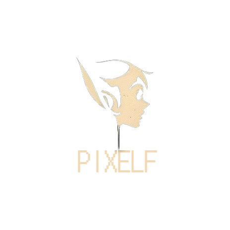
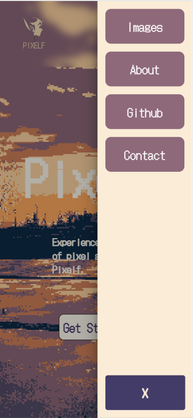
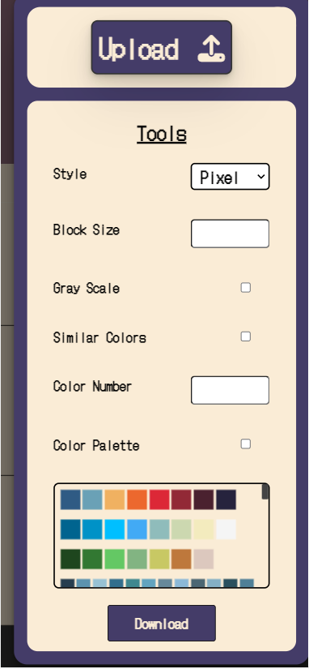

<a name="readme-top"></a>

[![Contributors][contributors-shield]][contributors-url]
[![Forks][forks-shield]][forks-url]
[![Stargazers][stars-shield]][stars-url]
[![Issues][issues-shield]][issues-url]
[![GPL License][license-shield]][license-url]
<!-- [![LinkedIn][linkedin-shield]][linkedin-url] -->

<!-- PROJECT LOGO -->
<br />
<div align="center">
  <a href="https://github.com/UtkuAltnkaya/Pixelf">
    
  </a>

  <h3 align="center">Pixelf</h3>

  <p align="center">
    A Pixel Art Project
    <br />
    <a href="https://github.com/UtkuAltnkaya/Pixelf"><strong>Explore the docs »</strong></a>
    <br />
    <br />
    <a href="https://github.com/UtkuAltnkaya/Pixelf">View Demo</a>
    ·
    <a href="https://github.com/UtkuAltnkaya/Pixelf/issues">Report Bug</a>
    ·
    <a href="https://github.com/UtkuAltnkaya/Pixelf/issues">Request Feature</a>
  </p>
</div>


<!-- TABLE OF CONTENTS -->
<details>
  <summary>Table of Contents</summary>
  <ol>
    <li>
      <a href="#about-the-project">About The Project</a>
      <ul>
        <li><a href="#built-with">Built With</a></li>
      </ul>
    </li>
    <li>
      <a href="#getting-started">Getting Started</a>
      <ul>
        <li><a href="#prerequisites">Prerequisites</a></li>
        <li><a href="#installation">Installation</a></li>
      </ul>
    </li>
    <!-- <li><a href="#usage">Usage</a></li> -->
    <li><a href="#images">Images</a></li>
    <!-- <li><a href="#contributing">Contributing</a></li> -->
    <li><a href="#license">License</a></li>
    <li><a href="#contact">Contact</a></li>
    <li><a href="#acknowledgments">Acknowledgments</a></li>
  </ol>
</details>


<!-- ABOUT THE PROJECT -->
## About The Project

[![Product Name Screen Shot][pixelf-gif]](https://github.com/UtkuAltnkaya/Pixelf)

Welcome to Pixelf, a powerful web application that lets you customize your images to suit your preferences. Our platform is designed to make the process of transforming images into beautiful works of art seamless and intuitive. Whether you are an experienced artist or a hobbyist, Pixelf offers a range of options to help you bring your creative vision to life.

At Pixelf, we understand the importance of customization. That's why we offer an array of options to modify your images, including adjusting block size, color palette, and converting images to grayscale. Our website also provides a range of styles, including pixel, linear, and cubic, to give your images a unique touch.

But that's not all. Pixelf also offers the option to customize your images using the K-Means algorithm. By selecting the similar colors option, our website can adjust the colors in your images to create stunning visuals. Our image processing technology is powered by C++, which takes values from JavaScript as environment variables to create images that are nothing short of breathtaking.

We believe that Pixelf is an excellent tool for anyone looking to take their image customization game to the next level. Our platform is user-friendly, making it easy for users of all skill levels to navigate and modify their images. By exploring the options available on our website, you can experiment and let your creativity run wild.

Thank you for choosing Pixelf, and we hope that our platform exceeds your expectations. If you have any questions or feedback, please don't hesitate to contact us.

<p align="right">(<a href="#readme-top">back to top</a>)</p>


### Built With

Pixelf is built using a combination of C++, JavaScript, HTML, CSS, and Node.js with Express.js as the backend framework.

* [![javascript][javascript]][javascript-url]
* [![html][html]][html-url]
* [![css][css]][css-url]
* [![node][node]][node-url]
* [![express][express]][express-url]
* [![c++][c++]][c++-url]
* [![openCV][openCV]][openCV-url]


<p align="right">(<a href="#readme-top">back to top</a>)</p>


<!-- GETTING STARTED -->
## Getting Started

Getting started with Pixelf is easy! To begin, simply visit our website and click on the "Upload" button to upload your image. Once your image is uploaded, you can use our intuitive interface to customize your image with various options, including block size, color palette, style, and K-Means algorithm for similar colors.

To customize your image, simply adjust the values for the options mentioned above, and the preview will update automatically. Once you are satisfied with the changes, click on the "Download" button to save your customized image to your device.

If you're interested in exploring the code behind Pixelf, you can also download it and run it on your local machine by following the instructions provided in our documentation.

### Prerequisites

To install the required files, please enter the following commands into your terminal: 

  ```sh
  npm install 
  ```

### Installation

_Installing the Pixelf is quick and easy. Follow these simple steps to get started in just a few minutes!_

1. To build the Pixelf files on your local machine, you'll need to download and install Visual Studio 2019 or a newer version.
2. Clone the repository to your local machine:
   ```sh
   git clone https://github.com/UtkuAltnkaya/Pixelf
   ```
3. Install the required dependencies:
   ```sh
   npm install
   ```
   _Note: While it is possible to build Pixelf using other compilers, we recommend using Visual Studio 2019 or a newer version to ensure compatibility and avoid potential errors during the build process._
4. Open the project in Visual Studio Code or your preferred code editor.
5. To start the Pixelf backend, navigate to the "Backend" folder in your command prompt or terminal and type "npm run dev" to launch the development server.


   ```js
   That's it! You're now ready to use the Pixelf.
   ```

<p align="right">(<a href="#readme-top">back to top</a>)</p>


<!-- USAGE EXAMPLES -->
<!-- ## Usage

Use this space to show useful examples of how a project can be used. Additional screenshots, code examples and demos work well in this space. You may also link to more resources.

_For more examples, please refer to the [Documentation](https://example.com)_

<p align="right">(<a href="#readme-top">back to top</a>)</p> -->


<!-- Images -->
## Images

[![Getting Started][getting-started]](https://github.com/UtkuAltnkaya/Pixelf)

_Above you can see the getting started section._

[![cards-section][cards-section]](https://github.com/UtkuAltnkaya/Pixelf)

_Here, you can see our image cards that showcase sample images customized with Pixelf._

[![how-to-section][how-to-section]](https://github.com/UtkuAltnkaya/Pixelf)

_The photograph includes a "How to pixel an Image" section that provides a visual guide on how to use Pixelf to customize your images._


<!-- <p>
  
</p>

<p>
  
</p> -->


[![upload][upload]](https://github.com/UtkuAltnkaya/Pixelf)

_The "Upload" section on the modal allows you to easily upload an image that you wish to customize with Pixelf. Simply click on the "Upload" button, select your image file, and it will be instantly loaded into the Pixelf interface for editing._

[![download][download]](https://github.com/UtkuAltnkaya/Pixelf)

_Once you've customized your image to your liking with Pixelf, you can download the final result by clicking the "Download" button. Pixelf is completely free to use, and you can download your customized images at no cost._


See the [files](https://github.com/UtkuAltnkaya/Pixelf) for the detailed explanations on the code.

<p align="right">(<a href="#readme-top">back to top</a>)</p>


<!-- CONTRIBUTING -->
<!-- ## Contributing

Contributions are what make the open source community such an amazing place to learn, inspire, and create. Any contributions you make are **greatly appreciated**.

If you have a suggestion that would make this better, please fork the repo and create a pull request. You can also simply open an issue with the tag "enhancement".
Don't forget to give the project a star! Thanks again!

1. Fork the Project
2. Create your Feature Branch (`git checkout -b feature/AmazingFeature`)
3. Commit your Changes (`git commit -m 'Add some AmazingFeature'`)
4. Push to the Branch (`git push origin feature/AmazingFeature`)
5. Open a Pull Request

<p align="right">(<a href="#readme-top">back to top</a>)</p> -->


<!-- LICENSE -->
## License

Distributed under the GNU General Public License v3.0 License. See `LICENSE.txt` for more information.

<p align="right">(<a href="#readme-top">back to top</a>)</p>


<!-- CONTACT -->
## Contact


Bayram Alper KILIÇ - [@alperrkilic](https://www.linkedin.com/in/bayram-alper-kilic/) - alperkilicbusiness@gmail.com  
[![LinkedIn][linkedin-shield]][linkedin-url]
[![Github][github-shield]][github1-url]
[![Gmail][gmail-shield]][gmail1-url]


Turgut Utku ALTINKAYA - [@UtkuAltnkaya](https://github.com/UtkuAltnkaya) - utkualtinkayabusiness@outlook.com

[![LinkedIn][linkedin-shield]][linkedin-url]
[![Github][github-shield]][github2-url]
[![Gmail][gmail-shield]][gmail2-url]


Burak ATEŞ - [@AtesBurak1](https://github.com/AtesBurak1) - burakatesbusiness@gmail.com


[![LinkedIn][linkedin-shield]][linkedin2-url]
[![Github][github-shield]][github3-url]
[![Gmail][gmail-shield]][gmail3-url]


Project Link: [https://github.com/UtkuAltnkaya/Pixelf](https://github.com/UtkuAltnkaya/Pixelf)

<p align="right">(<a href="#readme-top">back to top</a>)</p>


<!-- ACKNOWLEDGMENTS -->
## Acknowledgments

Creating a project like the Pixelf requires a lot of research, experimentation, and dedication. We would like to take this opportunity to acknowledge and thank the many individuals, channels, and websites that helped us along the way. Without their guidance and support, this project would not have been possible. In particular, we would like to recommend the following channels and websites for their invaluable resources and contributions to the field of web development and image processing.

* [Midjourney](https://www.midjourney.com/home/?callbackUrl=%2Fapp%2F)
* [Hyperplexed](https://www.youtube.com/@Hyperplexed)
* [ChatGPT](https://chat.openai.com/chat)
* [Choose an Open Source License](https://choosealicense.com)
* [Img Shields](https://shields.io)
* [OpenCV](https://opencv.org/)


<p align="right">(<a href="#readme-top">back to top</a>)</p>


<!-- Shields Section -->
[contributors-shield]: https://img.shields.io/github/contributors/UtkuAltnkaya/Pixelf.svg?style=for-the-badge
[contributors-url]: https://github.com/UtkuAltnkaya/Pixelf/graphs/contributors

[forks-shield]: https://img.shields.io/github/forks/UtkuAltnkaya/Pixelf.svg?style=for-the-badge
[forks-url]: https://github.com/UtkuAltnkaya/Pixelf/forks

[stars-shield]: https://img.shields.io/github/stars/UtkuAltnkaya/Pixelf.svg?style=for-the-badge
[stars-url]: https://github.com/UtkuAltnkaya/Pixelf/stargazers

[issues-shield]: https://img.shields.io/github/issues/UtkuAltnkaya/Pixelf.svg?style=for-the-badge
[issues-url]: https://github.com/UtkuAltnkaya/Pixelf/issues

[license-shield]:https://img.shields.io/github/license/UtkuAltnkaya/Pixelf.svg?style=for-the-badge
[license-url]: https://github.com/UtkuAltnkaya/Pixelf/blob/main/LICENSE.txt

[linkedin-shield]: https://img.shields.io/badge/-LinkedIn-black.svg?style=for-the-badge&logo=linkedin&colorB=555
[linkedin-url]: https://www.linkedin.com/in/bayram-alper-kilic/
[linkedin2-url]: https://www.linkedin.com/in/burak-ate%C5%9F-b102b020b/

[github-shield]: https://img.shields.io/badge/GitHub-100000?style=for-the-badge&logo=github&logoColor=white
[github1-url]:https://github.com/alperrkilic
[github2-url]: https://github.com/UtkuAltnkaya
[github3-url]: https://github.com/AtesBurak1


[gmail-shield]: https://img.shields.io/badge/Gmail-D14836?style=for-the-badge&logo=gmail&logoColor=white
[gmail1-url]: mailto:alperkilicbusiness@gmail.com
[gmail2-url]: mailto:utkualtinkayabusiness@outlook.com
[gmail3-url]: mailto:burakatesbusiness@gmail.com


<!-- Build With -->
[javascript]: https://img.shields.io/badge/JavaScript-323330?style=for-the-badge&logo=javascript&logoColor=F7DF1E
[javascript-url]: https://www.javascript.com/

[html]: https://img.shields.io/badge/HTML-239120?style=for-the-badge&logo=html5&logoColor=white
[html-url]: https://html.spec.whatwg.org/multipage/


[CSS]: https://img.shields.io/badge/CSS-239120?&style=for-the-badge&logo=css3&logoColor=white
[css-url]: https://www.w3.org/Style/CSS/


[node]: https://img.shields.io/badge/Node.js-43853D?style=for-the-badge&logo=node.js&logoColor=white
[node-url]: https://nodejs.org/en/


[c++]: https://img.shields.io/badge/C%2B%2B-00599C?style=for-the-badge&logo=c%2B%2B&logoColor=white
[c++-url]: https://cplusplus.com/

[openCV]: https://img.shields.io/badge/opencv-%23white.svg?style=for-the-badge&logo=opencv&logoColor=white
[openCV-url]: https://opencv.org/

[express]: https://img.shields.io/badge/Express.js-404D59?style=for-the-badge
[express-url]: https://expressjs.com/

<!-- Images -->
[pixelf-gif]: https://github.com/UtkuAltnkaya/Pixelf/blob/main/readme-images/Pixelf.gif
[cards-section]: readme-images/cards-section.png
[contributors]: readme-images/contributors.png
[download]: readme-images/download.png
[upload]: readme-images/upload.png
[how-to-section]: readme-images/how-to-section.png
[getting-started]: readme-images/getting-started.png
[responsive-design]: readme-images/responsive-design.png
[responsive-design2]: readme-images/responsive-design2.png

